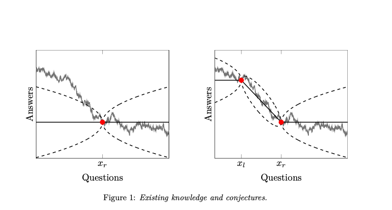

# A Quest for Knowledge

 > By Christoph Carnehl and Johannes Schneider. Link [here](https://josndr.github.io/KnowledgeQuest.pdf). 

- Trying to model the consequences of very novel research (like moonshoots)
- Vannaver Bsuh pled with FDR to preserve freedom of inquiry by federally funding basic research ("the pacemaker of technological progress")
- "Good scientists study the most important problems they think they can solve" (Peter Medawar)
- Assume that answers to questions follow the realization ofa Brownian path. 

- Decision-makers benefit by getting precise knowledge about \\( x_i \\), validating their knowledge to the left or \\(x_i \\), and by forming conjectures up to \\(x_r \\)
- The model of the researcher seems sound (benefits proportional to the decision-maker, research process is a search for an answer, cost of effort is increasing and convex) but leads to a counter-intuitive conclusion: a more novel question actually decreases the risk of failure 
    - Novelty and output are non-trivially linked 
- Failure case is ladder structure 